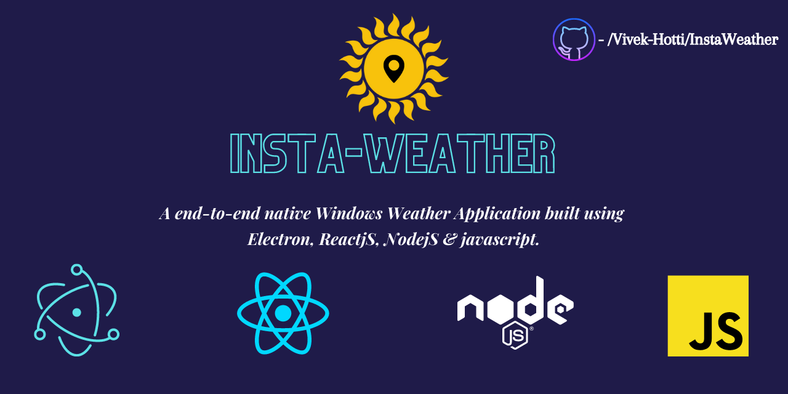
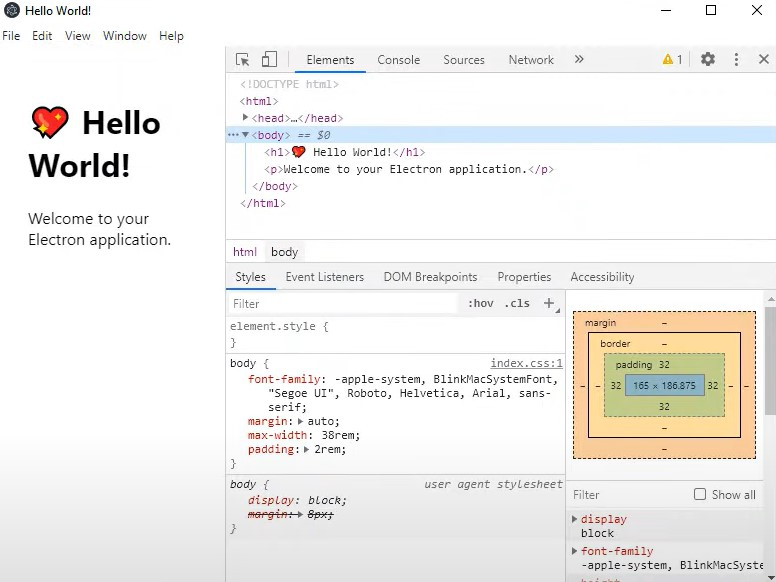
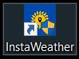
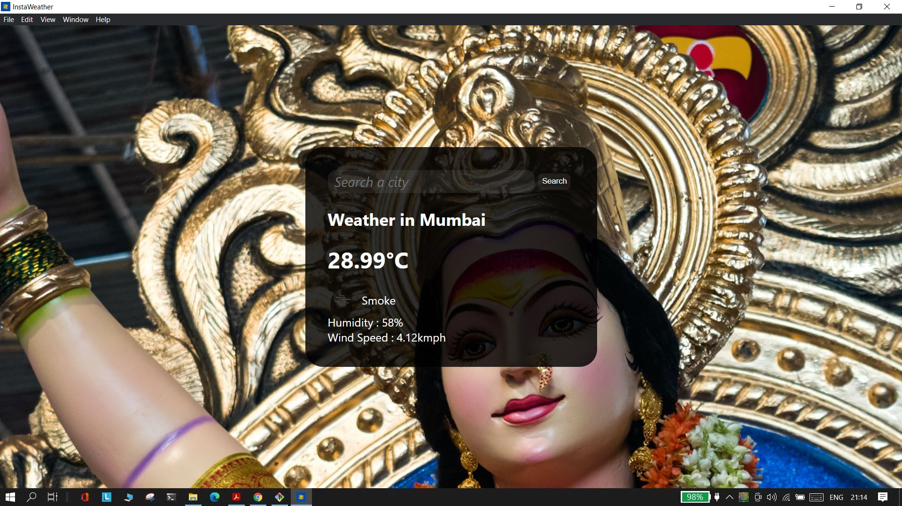
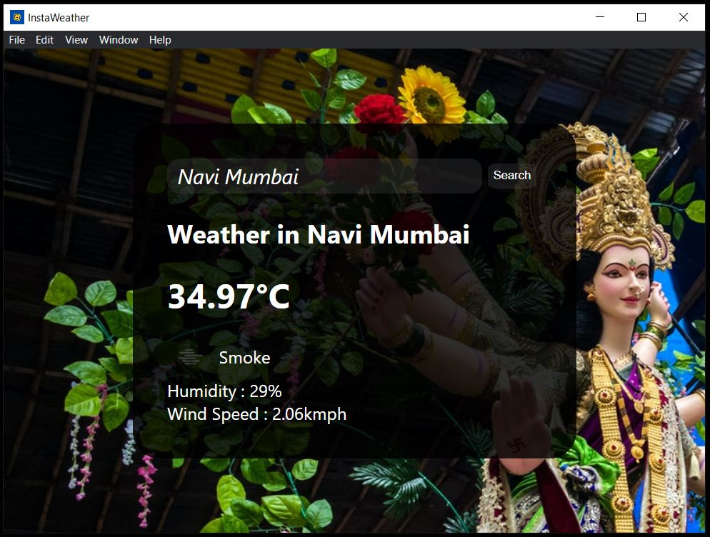
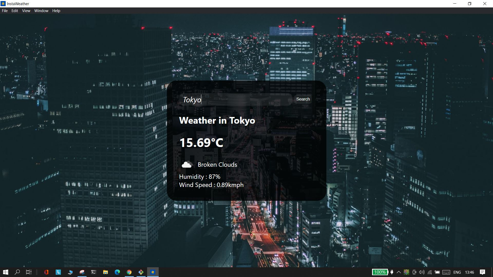
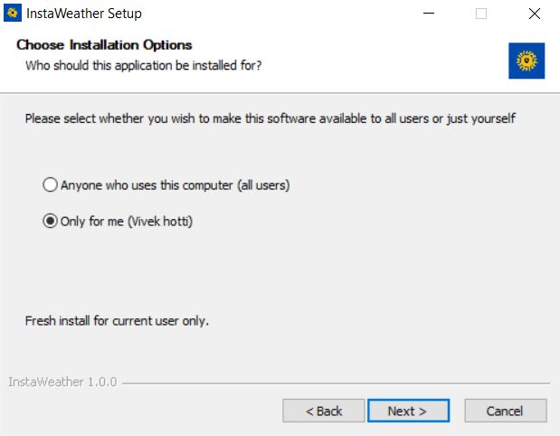
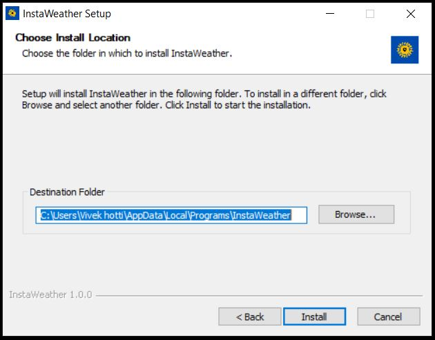

 

# INSTAWEATHER
A end-to-end Windows Weather Application built using Electron, ReactJS, NodeJS & Javascript.

### ➤ Project structure :
```
📁INSTAWEATHER
└─📁assets            
└─📁src            
  ├─📄icon.ico          
  ├─📄index.css    
  ├─📄index.html 
  ├─📄index.js 
  └─📄main.js       
├─💼InstaWeather Setup 1.0.0.exe                  
├─📄package-lock.json      
├─📄package.json  
└─📄yarn.lock 
```

### ➤ Project Requirements & Fresh Initial Setup:
To run this project on your local environment, you will have to:
- First, Install NodeJS (v8.9.4 or later)
- Then you will have to install Electron using:
  ```npm install -g electron```.
- After successfull installation, lets get started right away with a electon boiler plate. To install that use: ```npm install -g create-electron-app```. After which you will be able to use the command ```create-electron-app (project_name)```.
- Voila, a dummy electron app with a bolierplate is ready. This will give you a headstart. Navigating into your projects folder, and running the command ```npm run start```, you get:<br/>
  <p align="center">
   
  </p>
 

### ➤ Getting Started with Local Deployment:
- ***The only step for deployment*** : After cloning this repository in your local browser and installing all dependencies as said above, navigate into the cloned folder and run the command: ```npm run start```.

### ➤ Project Demo pics.
  <p align="center">
   
  </p>
  <p align="center">
   
  </p>
  <p align="center">
   
  </p>
  <p align="center">
   
  </p>
  <p align="center">
   
  </p>
  <p align="center">
   
  </p>
  <p align="center">
   
  </p>

<p align="center">
    <i>2021© Vivek Hotti. <br/>
    All Rights Reserved under the MIT Open Licence. <br/>
</p>
